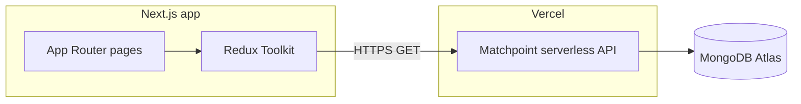

# Matchpoint Web

Web companion for [Matchpoint](https://github.com/octapf/matchpoint): browse **public** beach volleyball tournaments, teams, matches, and standings in the browser. It consumes the **same** Matchpoint backend (Vercel serverless API + MongoDB Atlas)—**no database credentials in the client**; all data flows over HTTPS like the mobile app.

**By [Miralab](https://miralab.ar)**

---

## Who this is for

| Audience | What to read |
|----------|----------------|
| **Recruiters / engineers** | This file: product scope, stack, how it talks to Matchpoint. |
| **Running locally** | Prerequisites, env, and scripts below. |

---

## Problem and approach

The Matchpoint app is where organizers and players manage tournaments. This repo adds a **web front** for the same domain and API: public tournament data via existing endpoints (no sign-in on the web). The stack highlights **Next.js**, **TypeScript**, **Tailwind**, **Redux**, **Jest**, and **accessible, responsive UI** aligned with the app’s dark theme (yellow / violet).

---

## Architecture



| Layer | Stack |
|-------|--------|
| **Web** | Next.js 16 (App Router), React 19, TypeScript |
| **Styling** | Tailwind CSS v4 (Matchpoint-aligned tokens) |
| **State** | Redux Toolkit (list + tournament page data) |
| **Testing** | Jest, React Testing Library |
| **Backend** | Same as Matchpoint: [Vercel `api/`](https://github.com/octapf/matchpoint) |

---

## Features

- **Home:** public tournament list with aggregate counts when the API returns them (teams, players, waitlist). Manual **refresh** in the header reloads the list.
- **Tournament detail:** tabs for **Summary**, **Teams** (`GET /api/teams`), **Players**, **Matches**, and **Standings** (detail fetched with `includeMatches=1` & `includeStandings=1`). Each match links to a **match detail** page. Private tournaments remain hidden without auth (API returns 404). Optional **background polling** (default every **15s** while the tab is visible) plus a header **refresh** button. Configure `NEXT_PUBLIC_TOURNAMENT_POLL_MS` or set `0` to disable polling.
- **SEO:** dynamic page titles via `generateMetadata` (server fetch to the API).
- **A11y:** skip link, focus styles, semantic landmarks.

---

## Prerequisites

- **Node.js 20+**
- npm
- A deployed **Matchpoint** API URL (same project as the mobile app)

---

## Quick start

```bash
git clone https://github.com/octapf/matchpoint-web.git
cd matchpoint-web
cp .env.example .env.local
# Set NEXT_PUBLIC_MATCHPOINT_API_URL=https://<your-matchpoint-vercel-origin>
npm install
npm run dev
```

Open [http://localhost:3000](http://localhost:3000).

---

## Environment

| Variable | Required | Description |
|----------|----------|-------------|
| `NEXT_PUBLIC_MATCHPOINT_API_URL` | Yes | Origin of the Matchpoint deployment **without** a trailing slash (e.g. `https://matchpoint.vercel.app`). |
| `NEXT_PUBLIC_TOURNAMENT_POLL_MS` | No | On **tournament detail**, re-fetch interval in ms (clamped 5 000–120 000). Default **15 000** (15s) if unset. Set **`0`** to disable background refresh. |

If Matchpoint uses **`CORS_ALLOWED_ORIGINS`**, add this site’s origin (e.g. `https://matchpoint.miralab.ar` or your Vercel preview URL).

---

## Scripts

| Command | Purpose |
|---------|---------|
| `npm run dev` | Development server |
| `npm run build` | Production build |
| `npm run start` | Run production build locally |
| `npm run test` | Jest |
| `npm run lint` | ESLint |

---

## Deploy (Vercel)

### Continuous deployment from GitHub

Deployments on **push** are handled by **Vercel’s Git integration** (no extra workflow file required).

1. Open [Vercel Dashboard](https://vercel.com) → **Add New…** → **Project**.
2. **Import** this repository (`octapf/matchpoint-web`). Grant the Vercel GitHub App access to the repo if prompted.
3. Configure **Environment Variables**: add `NEXT_PUBLIC_MATCHPOINT_API_URL` (same value as in `.env.local`, no trailing slash).
4. Click **Deploy**.

After that:

- Every **push to `main`** triggers a **Production** deployment.
- **Pull requests** get **Preview** URLs by default.

**Already have a Vercel project without Git?** → Project **Settings → Git** → **Connect Git Repository**, choose this repo and **Production Branch** `main`.

Optional: **Settings → Domains** for a custom hostname.

---

## Related

- **Mobile + API:** [github.com/octapf/matchpoint](https://github.com/octapf/matchpoint)
